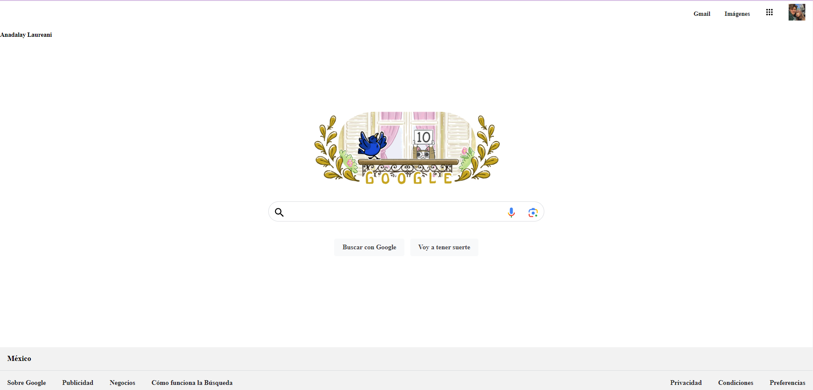

# Clon de Google TECHNOLOCHICAS PRO

El presente proyecto es un Clon de Google desarrollada para poner en práctica las habilidades dentro del bootcamp de desarrollo frontend de Technolochicas PRO.

Fue desarrollado con HTML y CSS. La página es responsiva (adaptable a diferentes tamaños de pantalla).

[Proyecto Desplegado (https://clon-google-anadalay.vercel.app/)](https://clon-google-anadalay.vercel.app/)

## Secciones de mi sitio

## Tecnologías

* HTML
* CSS

---
Desarrollado con 💖 por [Anadalay](https://www.linkedin.com/in/anadalay-laureani-longino-11bbaa26b/) en [TECHNOLOCHICAS PRO](https://tecnolochicas.mx/).